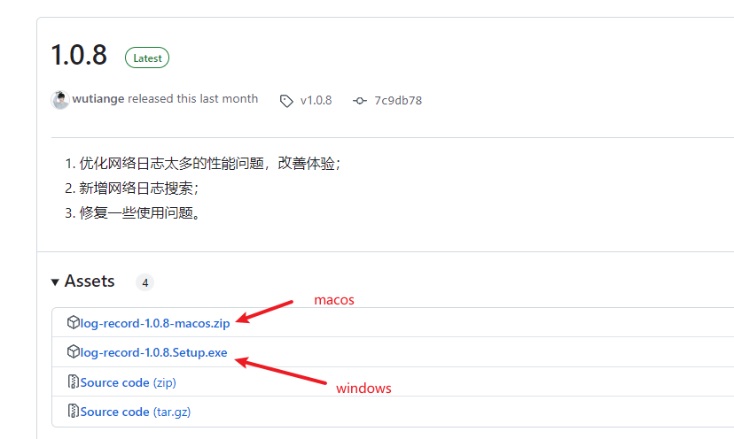
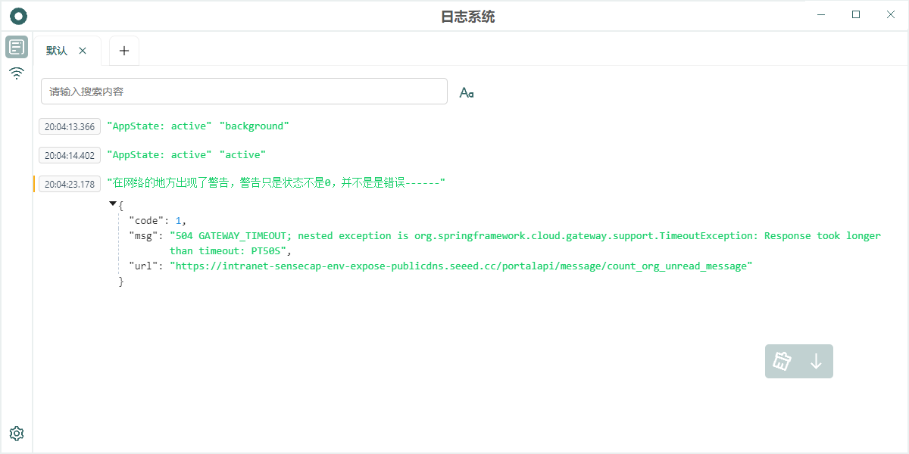
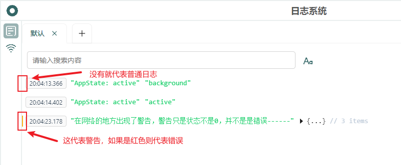
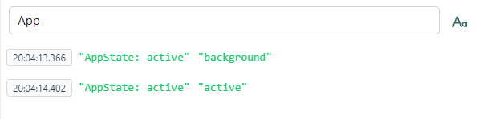
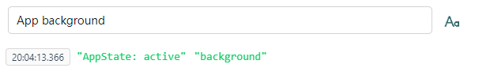
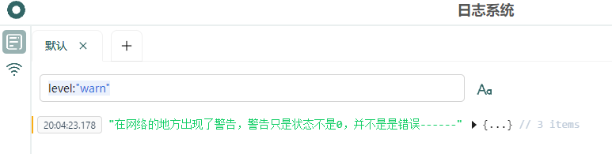

  

 

Log Record

 

English | [中文](./docs/README.zh-CN.md)

## 1. Introduction

A system for viewing logs in the release environment. Why does this system exist? It's because I found that when testers encountered problems during testing, they didn't know who was responsible; they always recorded bugs under my name. Additionally, some bugs were intermittent, appearing once and then disappearing the next time. With logs, testers don't need to reproduce the issue, and I can directly check the logs to find the problem. However, the logs might not be comprehensive enough, so it's important to log as much as possible when writing code to facilitate troubleshooting.

## 2. Integration

Before using the Log Record system, you first need to integrate [log-listener-plugin](https://github.com/wutiange/log-listener-plugin) into your project. Please refer to the corresponding documentation for specific integration instructions.

This project only supports [react-native](https://www.reactnative.dev/) projects.

## 3. Usage

I'll use `macOS` as an example. First, visit this website to download the corresponding version of the software. Try to download the latest version, as it has fixed many previous bugs:

<https://github.com/wutiange/log-record/releases>

Once there, download the latest version. After downloading, unzip it:

Double-click to open the Log Record system. However, you might usually see this prompt:

Don't panic at this point. Open "Settings", then open "Privacy & Security":

Then click "Open" in the popup dialog to complete the process. After this, logs will be displayed here as they are reported. To ensure proper display, note a few points: if you're opening this system on your computer, make sure your phone's WiFi is on the same network as your computer; and that you've successfully set the log reporting `testUrl` in your `App`. After opening, it looks like this:

If there are logs at this time, it will look like this:

Each log entry has a horizontal bar next to it, representing the log level, which are the three log types `log`, `warn`, and `error`, as shown in the image:

The second part is the time, which shows when the log was printed.

There are two buttons in the bottom right corner. The first one clears the current screen logs, and the second button maintains scrolling, which means it will scroll as logs increase.

One of the great features is search, which supports simultaneous search, meaning it uses AND logic. For example, if I want to search for logs containing "App":

I find there are still many logs, so I want to add "background" to the logs based on "status". Just use a space to separate the two pieces of text to perform a simultaneous search:

I wrote this because I sometimes have such needs in my daily development. In addition to this feature, the search can also filter error levels, phone models, and so on. Whatever types you pass in when you setBaseUrl, you can filter based on those. Below, I'll demonstrate filtering by log level.

Here, `level` represents the reported field name, and `warn` represents the corresponding value of the field. This format is fixed, and spaces cannot appear in between; spaces are treated as AND relationships.

## 4. Plans

- [x] Optimize performance issues with too many logs (1.0.6);
- [x] Optimize log search (1.0.6);
- [x] Optimize the viewing experience of network logs (1.0.7);
- [x] Add network clearing function (1.0.7);
- [x] Support manual update checks (1.0.7);
- [x] Optimize performance issues with too many network logs, improve experience (1.0.8);
- [x] Add network log search (1.0.8);
- [x] Add connection prompt for Log Record system (1.0.9);
- [x] Add English version (1.0.9);