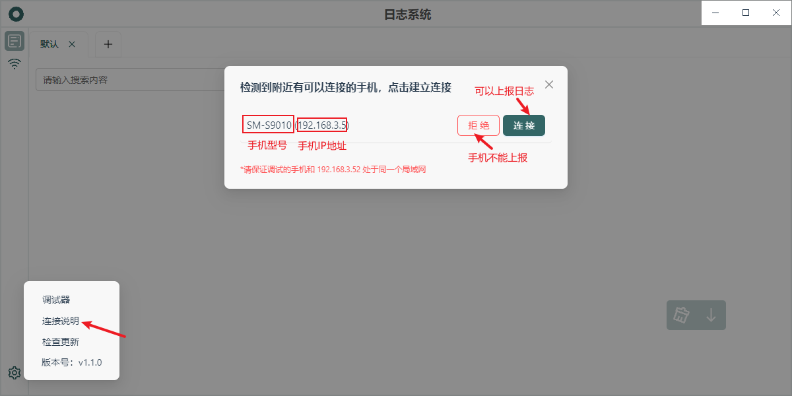
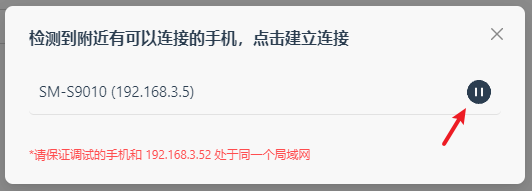

# Using Discovery Feature (1.2.x)

If your App integrates [log-listener-plugin](https://github.com/wutiange/log-listener-plugin) version 2.0.x or higher, and has integrated the [react-native-zeroconf](https://www.npmjs.com/package/react-native-zeroconf) plugin, you can enjoy the discovery feature. This feature eliminates the need to manually fill in the `testUrl` in the App, as it automatically discovers Log Record services within the local network.

When the logging system is discovered by the App, it will request to report logs, and you'll see the following page:

After clicking "Connect", it will change to this:

If you no longer want to collect logs from this App, you can click pause.

