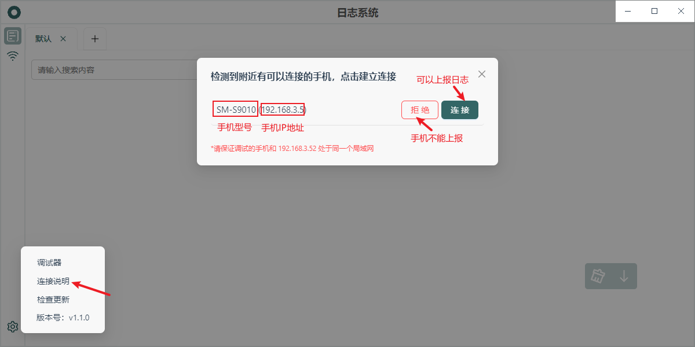
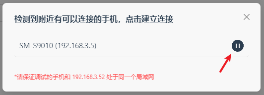
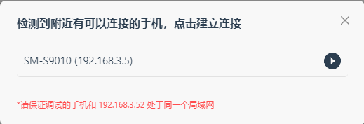

# 使用发现功能（1.2.x）

如果你 App 集成的 [log-listener-plugin](https://github.com/wutiange/log-listener-plugin) 版本大于等于2.0.x ，同时在 App 中集成了 [react-native-zeroconf](https://www.npmjs.com/package/react-native-zeroconf) 插件，那么你就可以享受发现功能了。发现功能无需在 App 中手动填写 `testUrl` ，会自动发现局域网中的 Log Record 服务。

当日志系统被 App 发现后就会请求上报日志，就会出现下面的页面：

当点击“连接”后，就会变成下面这样：

如果你此时不想再收集此 App 发来的日志，那么你可以点击暂停。

