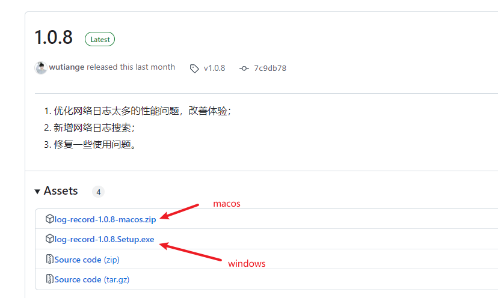
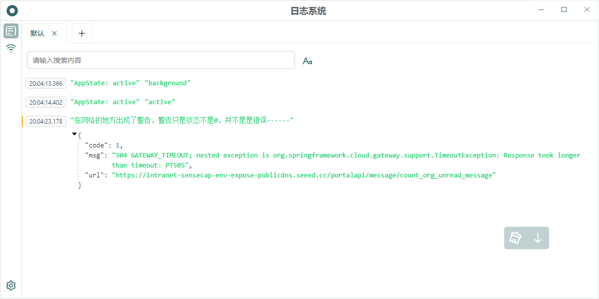
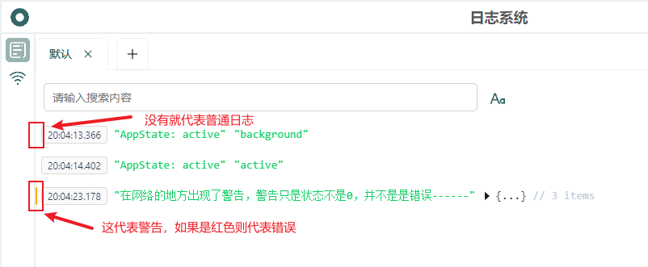
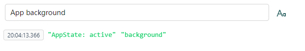

  

 

日志系统

 

中文 | [English](../README.md)

## 1. 介绍

用于在 Release 环境下查看日志的系统。这个系统的诞生源于实际开发过程中遇到的几个具体问题：

1. 测试工程师在测试过程中发现问题时，往往难以准确判断问题的来源；
2. 由于责任归属不明确，许多问题都被默认记录给了前端开发人员；
3. 一些偶发性问题出现一次后可能短期内无法复现，这给问题定位带来了很大困扰；
4. 对于网络日志每次使用 charles 过于繁琐。

通过这个日志系统，我们可以直接查看日志来定位问题，无需测试人员反复尝试复现。为了让系统发挥最大效用，我们建议在日常开发中尽可能详细地记录日志信息，这样可以更好地帮助我们排查和解决各类问题。

*特别提醒：尽量不要在线上使用，除非你进行了特别完善的测试。

## 2. 集成

在使用日志系统之前，你首先需要集成 [log-listener-plugin](https://github.com/wutiange/log-listener-plugin) 到你的项目。具体集成教程请参阅对应的文档。

[log-listener-plugin](https://github.com/wutiange/log-listener-plugin) 只支持 [react-native](https://www.reactnative.dev/) 项目。

## 3. 使用

我以 `macos` 为例。首先进入这个网站下载对应版本的软件，尽量下载最新的版本，因为新版修复了之前的很多 bug ：

<https://github.com/wutiange/log-record/releases>

进入后下载最新版本即可。下载后解压：

双击打开日志系统。但是一般会提示：

这个时候不要慌，打开“设置”，然后再打开“隐私与安全性”：

然后在出现的弹框中点击打开就完成了。接下来只要日志上报这上面就会显示了。要想正常显示在这上面，还需要注意几点，如果这个系统你是在你的电脑上打开的，那么你得保证你的手机 WiFi 跟你的电脑处于同一网络；在 `App` 中成功设置了日志上报的 `testUrl` 。打开之后长这样：

如果此时有日志，那么就会变成这样：

其中每一条日志旁边都有一个横条，这个横条代表日志等级，也就是 `log ,warn, error` 这三种日志类型，见图：

而第二部分则是时间，可以根据这个看出打印的时间。

右下角有两个按钮，第一个是清空当前屏日志，第二个按钮是保持滑动，也就是会跟随日志的增加而滚动。

其中还有一个很好的功能就是搜索，搜索支持同时搜，也就是既有又有的逻辑。打个比方我想搜索包含“App”的日志：

我发现日志还是很多，于是我想基于“App”的日志基础上新增“background”这个日志，只需要使用空格分开两段文本就可以完成同事搜索：

这个是我在平时的开发中有时候有这样的需求，所以写了这个。搜索除了这个功能外，还能过滤错误等级，手机型号等等功能，只要你 setBaseUrl 传入的类型有哪些那就你过滤就可以根据那些来进行，下面我演示根据日志等级过滤。

其中 `level` 代表上报的字段名，`warn` 代表字段的对应值。这个格式是固定的，中间不能出现空格，空格都当做是且的关系。

目前支持了发现功能，具体可参考 [使用发现功能上报日志v1.2.x](1.2.x.zh-CN.md)。

## 4. 计划

- [x] 优化日志太多的性能问题（1.0.6）；
- [x] 优化日志搜索（1.0.6）；
- [x] 优化网络日志的查看体验（1.0.7）；
- [x] 新增网络清空功能（1.0.7）；
- [x] 支持手动检查更新（1.0.7）；
- [x] 优化网络日志太多的性能问题，改善体验（1.0.8）；
- [x] 新增网络日志搜索（1.0.8）；
- [x] 新增连接日志系统提示（1.0.9）；
- [x] 新增英文版本（1.1.0）；
- [x] 新增黑暗模式（1.1.0）；
- [x] 新增发现模式（1.2.0）；
- [ ] 支持查看日志调用堆栈（1.3.0）；
- [ ] 支持显示崩溃日志（1.3.0）；
- [ ] 支持根据日志信息分析代码潜在的问题和优化建议（1.4.0）；